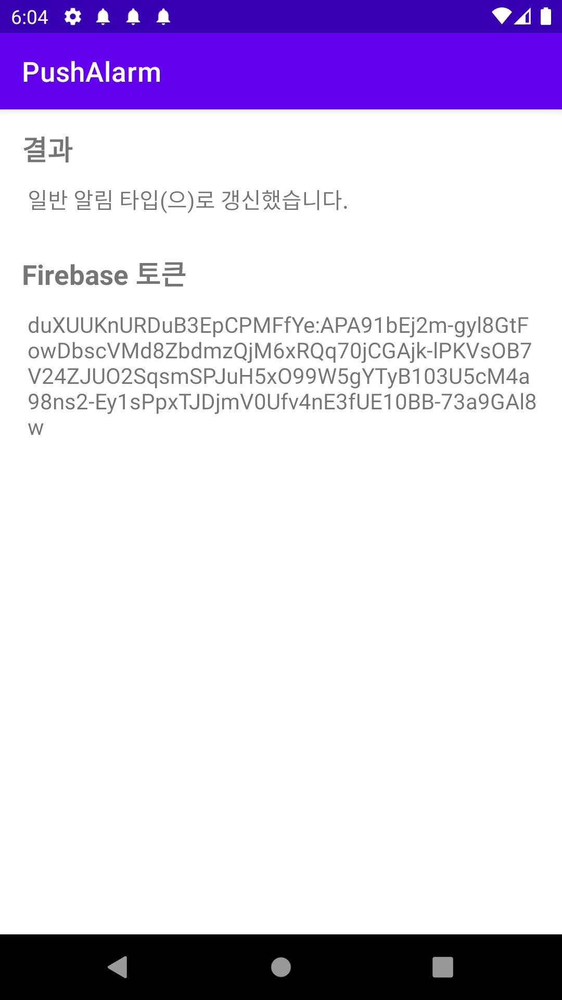
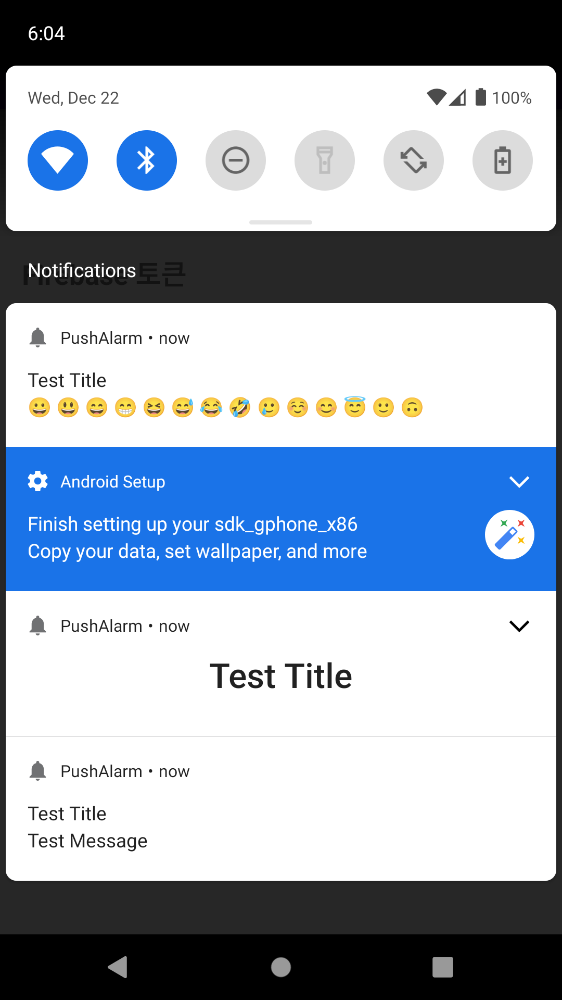

# Android Clone Coding Project #9 푸시 알림 수신기
FCM을 사용하여 푸시알림 구현 해보기
 

# 결과화면
|Screenshot1|Screenshot2|
|---|---|
|||

 

# 배운 내용 정리
- FCM
  - Normal Notification
  - Expandable Notification
  - Custom Notification
